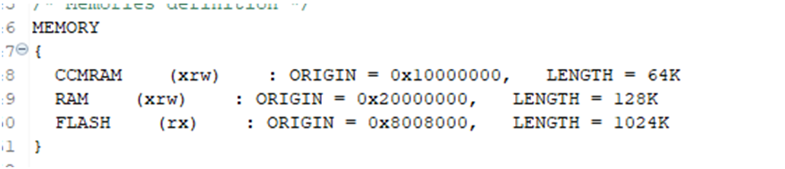
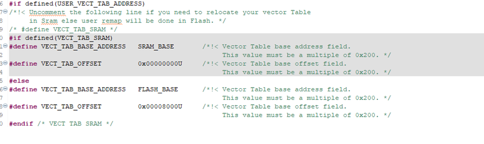
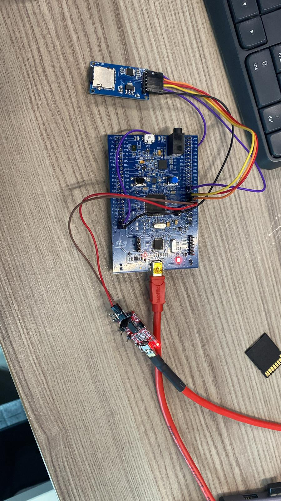
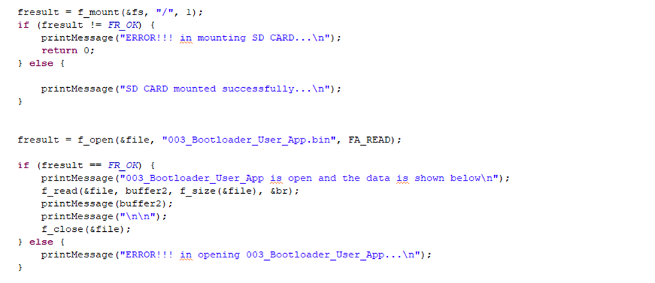
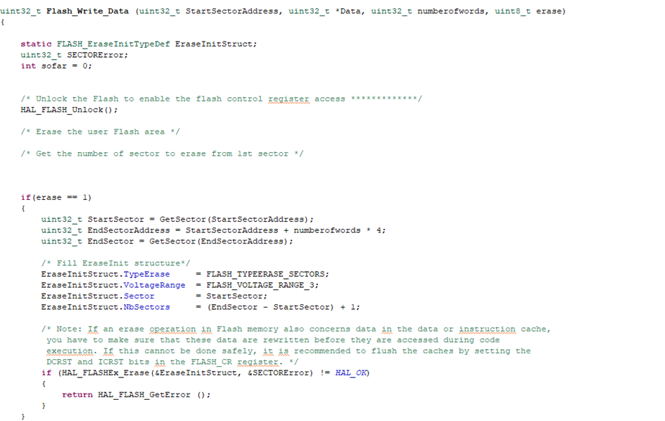
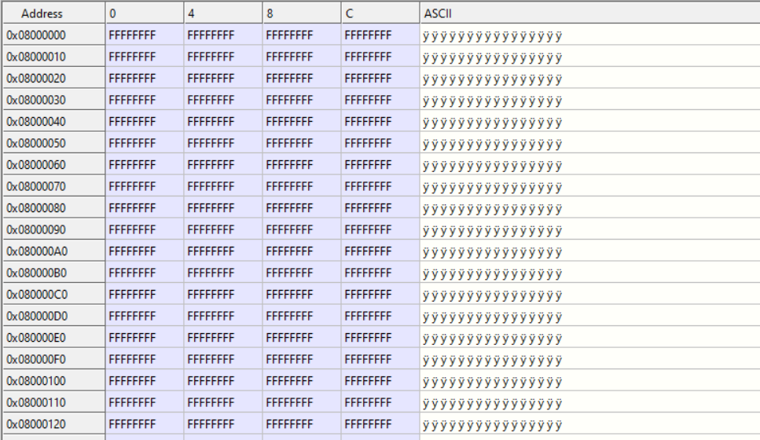
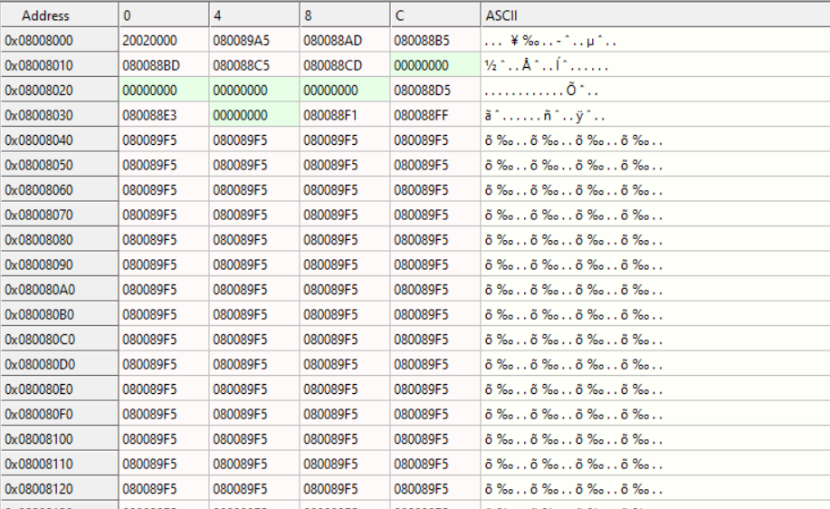
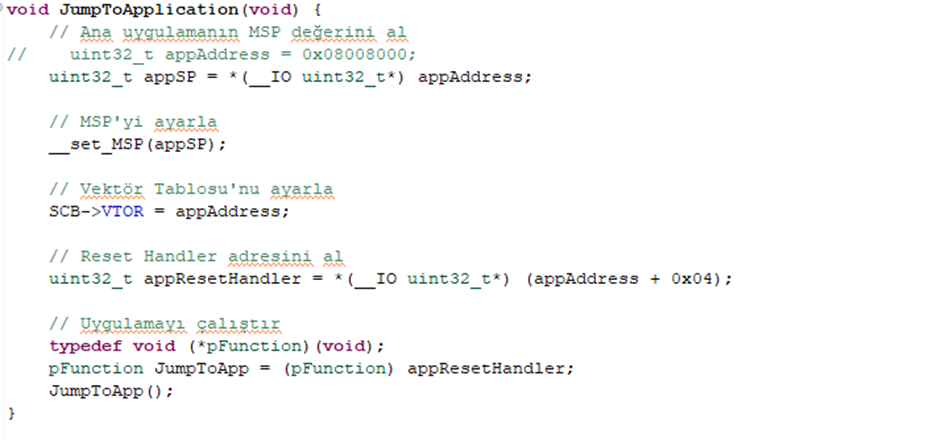

# SD CARD BOOTLOADER

## Giriş

Bootloader, mikrodenetleyiciler veya gömülü sistemlerde kullanılan küçük bir programdır. Sistemin açılışında çalışır ve ana uygulamayı başlatmadan önce bazı kritik görevleri yerine getirir. Bu projede, kodumuzu güncellemek için SD kart, UART veya uzaktan bağlantı (HTTPS, FTP) ile `.bin` dosyasını alacağız. Sonrasında bu dosyayı Flash hafızaya yazacağız.

En önemli nokta, güncelleyeceğimiz kodun başlangıç adresi (hafızada ve Startup dosyasında ayarlayacağımız) ile `.bin` dosyasını yazacağımız Flash hafıza adresinin aynı olması gerektiğidir. Aksi takdirde kod düzgün çalışmayacaktır. Şimdi adım adım işlemlere geçelim.

## Adımlar

### 1. Ana Kodun Başlangıç Adresi ve Vector Table Değişikliği

İlk adım olarak, ana kodumuzun başlangıç adresini ve Vector Table’ını değiştireceğiz.

`STM32F415RGTX_FLASH.ld` dosyasında `FLASH (rx)` kısmını değiştiriyoruz. Normalde 0x8000000 olan adresi, kullanmak istediğimiz Flash hafıza alanına göre güncelliyoruz.

Daha sonra, `startup_stm32f415rgtx.s` dosyasının içinde `SystemInit` fonksiyonunda `VECT_TAB_OFFSET` adresini 0x0000000'dan 0x0008000'e değiştiriyoruz. Kodumuzu yazdıktan sonra çalıştırıyoruz. Proje dosyasına girip `.bin` dosyasını alıyoruz.

### 2. Devre Bağlantıları

`.bin` dosyasını SD karta yükleyip devremize yerleştiriyoruz. Aşağıda devre şeması verilmiştir:

### 3. Kodlama

SD kart SPI üzerinden haberleşiyor. Takip etmeyi kolaylaştırmak için USB-TTL bağlantısı kullanıyoruz. SD kartın STM32 ile kullanımı ve dosya işlemleri için şu linklerden yararlanabilirsiniz:

- [SD Kart Kullanımı](https://controllerstech.com/sd-card-using-spi-in-stm32/)
- [SD Kart Kullanımı](https://blog.naver.com/eziya76/221188701172)

SD kart bağlantılarını yaptıktan ve kütüphaneyi doğru bir şekilde uyguladıktan sonra yukarıdaki kodları yazın. USB-TTL ile bağlantıyı test edebilirsiniz. `.bin` dosyasını aldıktan sonra Flash hafızaya yazma ve kodu çalıştırma işlemleri yapacağız.

### 4. Flash Hafızaya Yazma

STM32 Flash yazma işlemi için aşağıdaki fonksiyonu kullanıyoruz:

Bu kod, Flash hafızanın gerekli sektörünü önce temizler ve belirtilen veriyi hafıza alanına yazar.

### 5. Atlama Fonksiyonu (Jump to Application)

Normalde kod, 0x8000000 adresinden başlar ve sırasıyla çalışır. Aşağıdaki fonksiyon, çalışan kodu belirlediğimiz app adresine (örneğin 0x8008000) atlar:

Bu sayede, Flash hafızaya yazılan yeni kod çalışmaya başlar.
